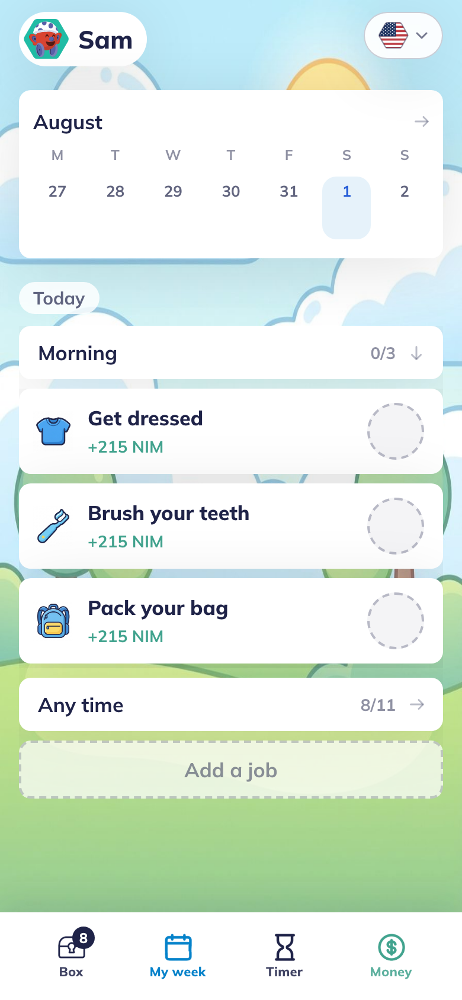
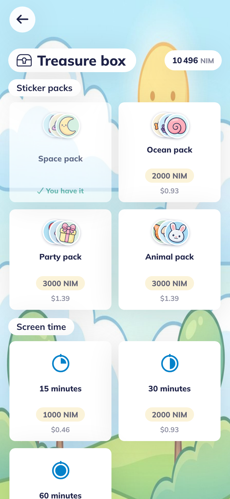
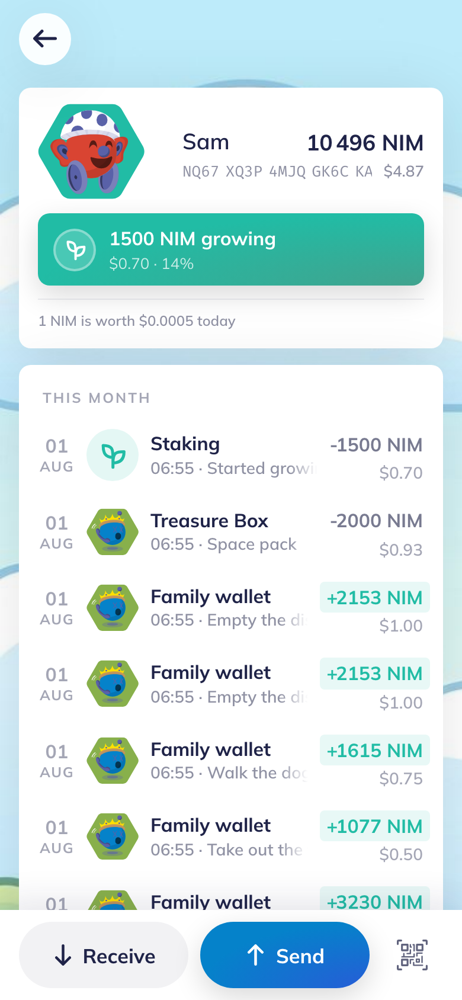
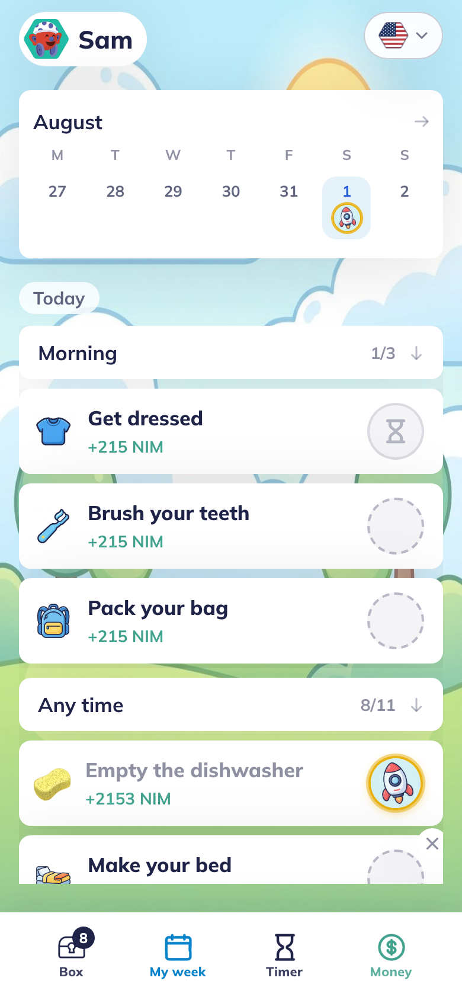
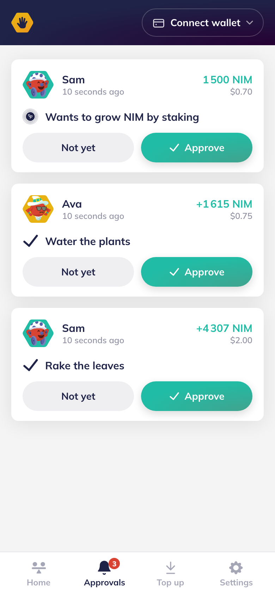
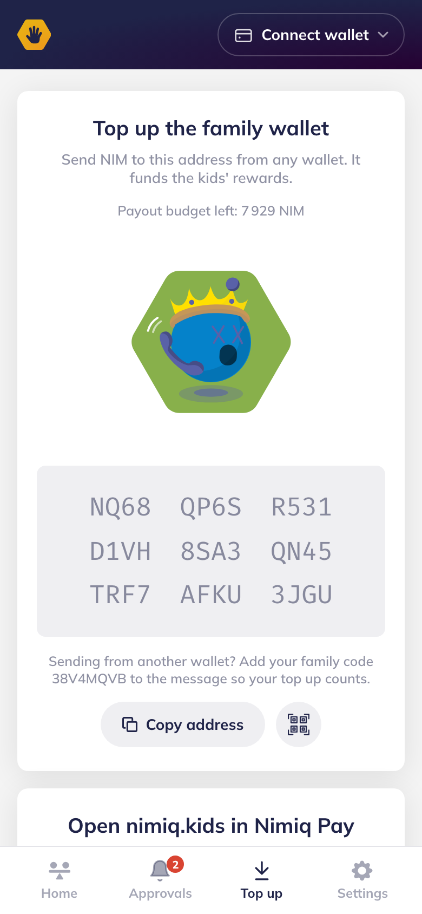
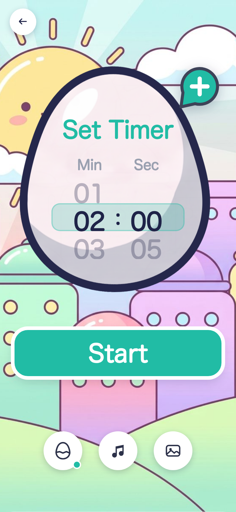
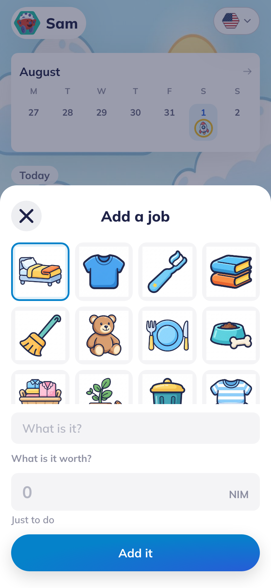
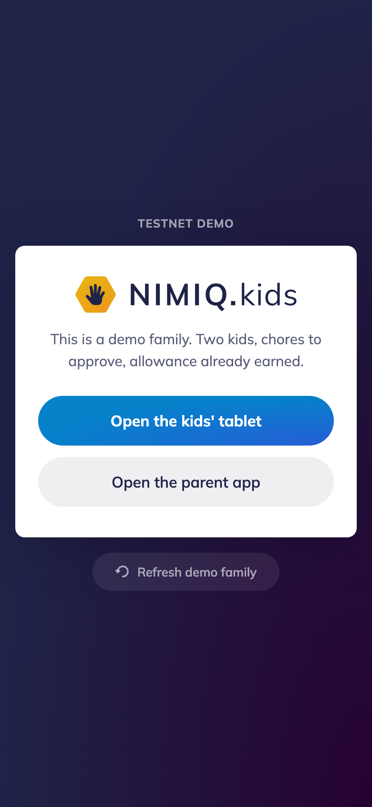

<div align="center">

<picture>
  <source media="(prefers-color-scheme: dark)" srcset="public/assets/brand/nimiq-kids-lockup-dark.svg">
  
</picture>

### Your house, running its own mini economy

A family ecosystem where kids do chores, routines and activities, and parents reward them in NIM.

[**Try the demo**](https://demo.nimiq.kids/demo) &nbsp;·&nbsp; [**Create your own**](https://nimiq.kids) &nbsp;·&nbsp; [Roadmap](docs/ROADMAP.md) &nbsp;·&nbsp; [Changelog](CHANGELOG.md) &nbsp;·&nbsp; [ANDJROO](https://andjroo.com)

[](https://github.com/Andjroo111/nimiq-kids/actions/workflows/ci.yml)
[](LICENSE)


<table>
<tr>
<td width="33%"></td>
<td width="33%"></td>
<td width="33%"></td>
</tr>
<tr>
<td align="center"><sub><b>The board.</b> Jobs, priced.</sub></td>
<td align="center"><sub><b>The Treasure Box.</b> Where it gets spent.</sub></td>
<td align="center"><sub><b>The wallet.</b> A real address, on chain.</sub></td>
</tr>
</table>

</div>

A parent sets the jobs and sets the price. The kid does the work. The parent approves the finished
chore from their own phone, and the payout is a real Nimiq transaction into an account that belongs
to the kid. Then the kid spends it back to the parent, on the things only a parent can sell: screen
time, a trip to the pool, a toy at the store. The parent re-funds. The family's net position is
flat. Nobody in this family loses a dollar.

Nothing moves until a parent approves it. There is no smart contract, no escrow, and no automatic
release. A finished chore is a request, not a trigger. The approval is the decision, and the send
settles in seconds.

## The circle

<table>
<tr>
<td width="25%"></td>
<td width="25%"></td>
<td width="25%"></td>
<td width="25%"></td>
</tr>
<tr>
<td align="center"><sub><b>1.</b> Kid marks it done</sub></td>
<td align="center"><sub><b>2.</b> It lands in the parent's queue</sub></td>
<td align="center"><sub><b>3.</b> Parent approves, and it pays</sub></td>
<td align="center"><sub><b>4.</b> The board remembers</sub></td>
</tr>
</table>

| Step | What happens | Where it lives |
|------|--------------|----------------|
| 1 | Parent creates a chore and prices it | `src/routes/chores.ts` |
| 2 | Kid marks it done, and it lands in the parent's queue | `src/routes/approvals.ts` |
| 3 | Parent approves. A real transaction goes from the family wallet to the kid's own address | `payKidEarn`, `src/wallet/kid-wallet.ts` |
| 4 | Kid buys in the Treasure Box. A real transaction goes from the kid's address back to the family wallet | `kidSpend`, `src/routes/store.ts` |
| 5 | Parent re-funds, and the loop runs again | `src/repo-budget.ts` |

Steps 3 and 4 are both on chain. The circular economy is not a metaphor in the marketing copy, it
is two transactions in opposite directions between the same two accounts. The money never leaves
the household. What actually changes hands is effort and attention.

Kids can also send outside the family. Those go out as a Cashlink minted from the kid's own key
once a parent approves the request (`executeSendRequest`), so the person on the other end claims
with no account and no install.

**Who holds the kid's key.** Two answers, per kid, recorded in `children.address_source`.
`parent`: the address comes out of a parent's own Nimiq wallet, proved with a signature, and no key
for it exists on this server. Payouts are signed by the parent's wallet. This is what nimiq.kids
runs (`HATCH_CUSTODY=parent`, since 3 August 2026): **non custodial**. `derived`: the legacy mode,
an account derived from a master seed the server holds (`src/nimiq/hd.ts`), server-custodied. New
kids get `parent`; older rows keep their mode. The parent's own wallet is separate under both and
never derived. Full statement: [`docs/WALLET-CONTRACT.md`](docs/WALLET-CONTRACT.md).

## Both sides of the house

<table>
<tr>
<td width="50%"></td>
<td width="50%"></td>
</tr>
<tr>
<td align="center"><sub>The queue. Nothing pays without this tap.</sub></td>
<td align="center"><sub>The family wallet, funded by the parent.</sub></td>
</tr>
</table>

The parent app is a phone. The kid app is a tablet that lives on the kitchen counter, and it is
built for someone who cannot read yet: art instead of labels, a timer shaped like an egg, and a
sticker to place when a job is done.

<table>
<tr>
<td width="50%"></td>
<td width="50%"></td>
</tr>
<tr>
<td align="center"><sub>The egg timer. Two minutes of brushing, made visible.</sub></td>
<td align="center"><sub>Every chore icon is drawn art, never an emoji.</sub></td>
</tr>
</table>

## What is actually built today

As of v0.43.0 on `main`, with `CHANGELOG.md` as the current record:

- **A real account per kid.** Every child gets a genuine derived Nimiq account at
  `m/44'/242'/7'/i'` (SLIP-0010 ed25519, `src/nimiq/hd.ts`). Only the small integer index is
  stored. The private key is never written to the database, it is re-derived on demand to sign.
- **A parent approvals queue**, with a per-approval payout ceiling denominated in dollars so it
  keeps its meaning as the price moves, and a per-family budget that payouts can never exceed.
- **The Treasure Box**, the spend-it-back side, with a parent-facing manager for the shelves.
  Categories come from data, so new shelves appear with no UI code change.
- **Grow**, real staking delegation to a validator, with the 100 NIM Albatross protocol floor
  measured against the live testnet rather than assumed (`src/nimiq/staking.ts`). Unstaking is
  modelled as the honest multi-step Albatross flow, not as an instant withdrawal.
- **Stickers, scenes and the egg timer** on the kid side. A four year old who cannot read can still
  work the app.
- **Multi-family from one instance.** Parent routes resolve the family from the bearer token,
  subject routes from the row they address. Two-household isolation is test-proven.
- **Self-serve onboarding.** A stranger creates their family in under a minute: two nicknames, one
  tap, sample chores seeded, optional wallet connect. Invite links carry a referral code.
- **Pairing codes.** If the in-wallet WebView drops the magic-link fragment, a signed-in session
  shows a six digit code that signs any device in.
- **Five languages**, de / en / es / fr / pt, with test coverage (`src/locales/`).
- **Two surfaces, one build.** Inside Nimiq Pay it uses the injected mini-app provider, in a plain
  browser it falls back to a browser wallet path. That selection happens in exactly one branch,
  `src/wallet/index.ts`.

360 tests across 38 files, all passing (`bun test`).

## Honest disclosure: the public demo runs with the kid side unlocked

`src/custody.ts` is the one place this is stated, so the API, the kid app and the parent app cannot
drift from each other or quietly claim a protection that is not switched on:

> True when kid-initiated sends and stakes execute WITHOUT a parent approval. Defaults to true
> because that is what the code does today, and defaulting to false would advertise a protection
> that does not exist.

Precisely:

- **Chore payouts always require the parent.** Nothing is paid out of a chore without an approval,
  in any build.
- **Kid-initiated sends and staking do not, in this build.** The approval gate for those two
  irreversible actions is designed and named but not shipped. Verified on the live testnet on
  2026-07-31: with the gate off, a request carrying no token, no PIN and no approval moved a kid's
  real on-chain NIM.
- The app says so on screen wherever a wallet response is rendered, and the flag that turns the
  gate on is named in `src/custody.ts`.

That is acceptable in a demo that states it plainly and unacceptable in one that does not. It is
the first thing to close after the competition.

## Deployments

Two, and they are deliberately different:

- **[A testnet demo](https://demo.nimiq.kids/demo)**, with a parent and two kids already set up,
  reset for each visitor. Walk the whole loop in a minute without creating anything or spending
  anything real.
- **[A live mainnet instance](https://nimiq.kids)**, where a visitor creates their own family. Real
  money, small money. Bounded by a per-family grant and a per-approval ceiling, so a public
  instance cannot be drained.

<div align="center">

</div>

The deploy kit for the public instance lives in `deploy/competition/`. It sets a flag that makes a
simulated-settlement misconfiguration fail loudly at boot, so a shipped build can never quietly
demo fake money.

## Stack

- Runtime: Bun + Hono
- Data: SQLite, with a Cloudflare D1 compatible schema
- Frontend: vanilla PWA, no framework
- Wallet: Nimiq Pay mini-app provider in wallet, browser wallet connect outside it. Parent-managed
  throughout, and kids never handle a seed phrase
- Chain: `@nimiq/core@2.5.1` for offline crypto only (keys, addresses, Cashlink codec, transaction
  building). Network calls go over HTTP JSON-RPC through `nimiq-settlement`, because the light
  client cannot reach consensus under Bun. See `docs/adr/` and `docs/NIMIQ-CASHLINK-REFERENCE.md`
- Deploy: launchd on a Mac Mini behind a Cloudflare tunnel, one isolated instance per surface
  (`com.hatch.competition` on mainnet, `com.hatch.testnet` for the demo), CI-gated. The Fly.io kit
  in `docs/DEPLOY.md` is a separate SIM-settlement deploy and serves neither public instance

## Develop

```bash
bun install
bun run seed     # seed demo data
bun run start    # http://localhost:3000
bun run dev      # watch mode
bun test         # 360 tests
bun run check    # typecheck (tsc --noEmit)
```

A fresh clone runs in SIM mode with no faucet and no network, so the whole UX is walkable straight
away. Set a funded key to run it against a real network. A deployed instance can be configured to
refuse to boot in SIM at all.

Every screenshot above is regenerated against a running instance by
[`tools/shots.mjs`](tools/shots.mjs), so they cannot quietly go stale while the app moves:

```bash
bun run shots    # stages a household through the real API, then captures
```

## Data, minors, and the rules that do not change

- No ads, no tracking, no loot boxes.
- No accounts for kids. A child record is a label and an avatar. No kid PII, ever.
- The parent funds everything, approves the chores, and can pause all of it.
- This is not legal advice. A written US legal opinion is required before any non-demo launch,
  because end users include children and COPPA and its state equivalents apply.

What kids learn here is that taking care of their own stuff is how they get what they want.

Nimiq is the thesis of crypto, but easy. Borderless, transparent, self-custodial, beautiful. What
it has never had is an ecosystem, somewhere people actually spend. That is what I am building, and
this app is one drop into that ocean. The rest of the fleet, and who is behind it, is at
[andjroo.com](https://andjroo.com).

## Where to go next

- [`docs/ROADMAP.md`](docs/ROADMAP.md), what comes next and what unlocks it
- [`docs/PRD.md`](docs/PRD.md), the original product definition
- [`docs/WALLET-CONTRACT.md`](docs/WALLET-CONTRACT.md) and [`docs/KIOSK-CONTRACT.md`](docs/KIOSK-CONTRACT.md), the two internal contracts
- [`CHANGELOG.md`](CHANGELOG.md), every release
- [andjroo.com](https://andjroo.com), the rest of the fleet and who is building it

<!-- nimiq-north-star -->
> 🧭 **North Star** · Every Nimiq project aligns to one shared set of values and a single mission.
> See the canonical [Nimiq Values & North Star](https://github.com/Andjroo111/nimiq.life/blob/main/NORTH-STAR.md).

## License

MIT, [ANDJROO](https://andjroo.com)
